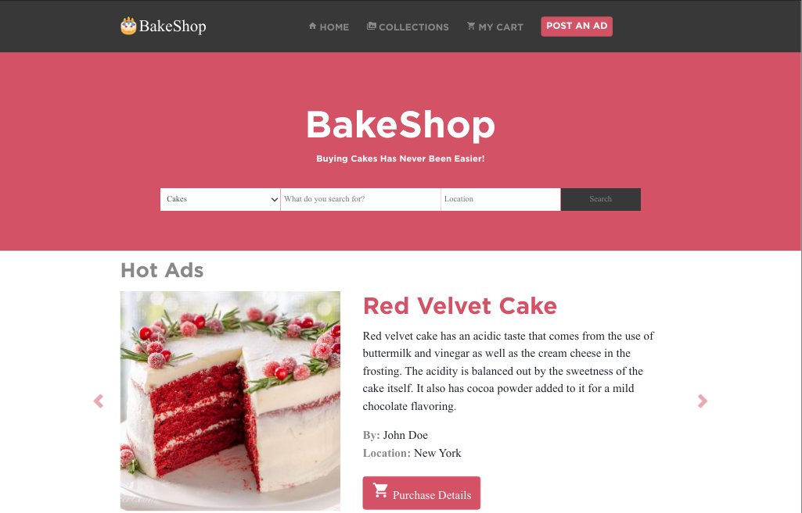

# online-shop (BakeShop)

> The goal of the project was to create a well designed website for an online bakery using the principles of responsive web design   

## Built With

- HTML
- CSS
- Bootstrap
- Font Awesome
- Google Material Icons

The website layout is based on the [ZATTIX design concept](behance.net/gallery/24796463/ZATTIX) by Mohammed Awad

## Live Demo

[Live Demo Link](https://newhorizon-tech.github.io/online-shop/)

## Authors

👤 **Alaukik**

- Github: [@newhorizon-tech](https://github.com/newhorizon-tech)
- Twitter: [@techintosh3](https://twitter.com/techintosh3)

## 🤝 Contributing

Contributions, issues and feature requests are welcome!

Feel free to check the [issues page](https://github.com/newhorizon-tech/newsweek-homepage/issues).

## Show your support

Give a ⭐️ if you like this project!
